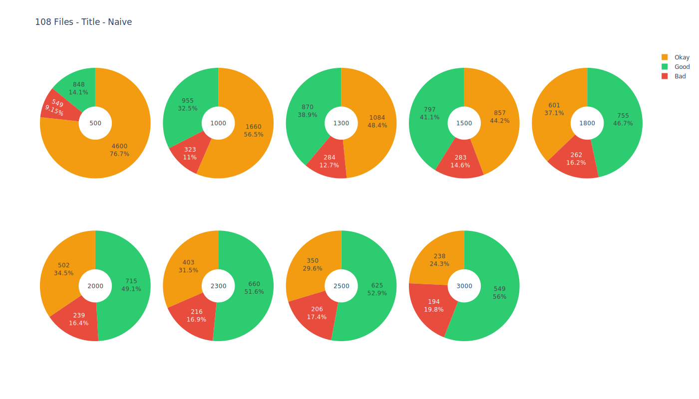

# Evaluation
The `evaluation.ipynb` Jupyter Notebook is used to compare different chunking methods and evaluate how much of **good**, **okay** and **bad** chunks are produced by each method.  

For the evaluation, [*unstructured.io*](https://unstructured.io/) is used to chunk the data.

## Used Data
`DATA_PATH`: 108 Files  
`SUB_DATA_PATH`: 17 Files

## Evaluation Metrics
- **Good Chunk**: 
    - **Start:** Title or Header
    - **End:** Any other Element **except** Title or Header
- **Okay Chunk**:
    - **Start:** Any other Element **except** Title or Header
    - **End:** Any other Element **except** Title or Header
- **Bad Chunk**:
    - **Start:** Any other Element
    - **End:** Title or Header

## Used Methods
*Unstructured.io* has 2 different chunking methods in open source:
- `basic`: This method chunks the data based on amount of characters.
- `by_title`: This method chunks the data based on the title.

Each Method is separated in **naive** and **advanced**.
- **Naive**: The method is used without any additional parameters.
    - Method has only additional parameter `max_characters` which is equal to `chunk_size` its a **hard cap**.
- **Advanced**: The method is used with additional parameters.
    - Method has additional paramters like `max_characters`, `new_after_n_chars`, and `combine_under_n_chars`.
    - This method is aiming to produce chunks with a length of `new_after_n_chars` but its a **soft cap** it can produce higher chunks if elements after the chunk are able to fit in the chunk. It can not produce chunks higher than `max_characters` its a **hard cap**.

## Evaluation Results
`basic` Results:

  
  
  
  

`by_title` Results:

  
  
  
  