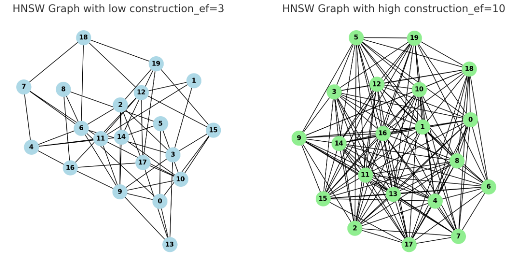

# Aufzeichnung Chat OpenAI

## User
hnsw:construction_ef¶
Description: Controls the number of neighbours in the HNSW graph to explore when adding new vectors. The more neighbours HNSW explores the better and more exhaustive the results will be. Increasing the value will also increase memory consumption.

Default: 100

Constraints:

Values must be positive integers.
Parameter cannot be changed after index creation.

erklär mir was diese einstellung macht

## AI
Die Einstellung construction_ef in HNSW (Hierarchical Navigable Small World) beschreibt einen wichtigen Parameter, der das Verhalten und die Genauigkeit des Algorithmus beim Aufbau des Indexes beeinflusst. HNSW ist eine weit verbreitete Methode für die annähernde nächste Nachbarsuche (Approximate Nearest Neighbor Search), die für schnelle und effiziente Ähnlichkeitssuchen in hochdimensionalen Vektorräumen verwendet wird.

**Was macht construction_ef?**
- Definition: construction_ef steuert die Anzahl der Nachbarn, die bei der Hinzufügung neuer Vektoren in den HNSW-Graphen untersucht werden.
- Kontext: HNSW erstellt einen Graphen aus Knoten (Vektoren) und Kanten (Verbindungen zwischen den Knoten). Bei der Konstruktion des Graphen, wenn ein neuer Vektor hinzugefügt wird, muss der Algorithmus entscheiden, welche bestehenden Knoten (Nachbarn) mit dem neuen Vektor verbunden werden. construction_ef gibt an, wie viele Nachbarn bei der Suche nach den besten Verbindungen untersucht werden.

**Einfluss von construction_ef:**  
1. **Mehr Nachbarn -> Bessere Genauigkeit:**
    - Wenn construction_ef höher ist, untersucht der Algorithmus mehr Nachbarn beim Hinzufügen eines neuen Vektors. Das führt dazu, dass der Graph genauer und stärker vernetzt wird, was später bei der Abfrage zu besseren Suchergebnissen führt, weil der Graph eine höhere Konnektivität aufweist.

2. **Mehr Nachbarn -> Höherer Speicherverbrauch:**
    - Ein höherer Wert von construction_ef bedeutet, dass der Algorithmus beim Hinzufügen eines neuen Vektors mehr Arbeit leistet und mehr Speicher benötigt. Denn mehr Knoten müssen verarbeitet und gespeichert werden, was den Aufbau und den Speicherverbrauch des Graphen erhöht.

3. **Kann nach der Index-Erstellung nicht geändert werden:**
    - Da construction_ef den Aufbau des Indexes betrifft, kann dieser Parameter nicht mehr geändert werden, sobald der Index erstellt ist. Das bedeutet, dass die Wahl dieses Wertes vor dem Aufbau des Graphen gut überlegt sein sollte.

**Zusammenfassung:**  
Niedriger Wert: Schnellere Index-Erstellung, aber möglicherweise weniger genaue Ergebnisse.
Hoher Wert: Genauere Ergebnisse, aber langsamerer Index-Aufbau und mehr Speicherverbrauch.
Die Standardeinstellung ist 100, was für viele Anwendungen eine gute Balance zwischen Genauigkeit und Ressourcennutzung darstellt. Wenn du eine höhere Präzision benötigst und ausreichend Speicher zur Verfügung hast, könntest du diesen Wert erhöhen.

## User
kannst du mir das visuell zeigen ein beispiel dazu?

## AI
Ja, ich kann dir gerne eine Visualisierung erstellen, die zeigt, wie der construction_ef-Parameter die Struktur und Vernetzung des HNSW-Graphen beeinflusst. Die Idee ist, dass ein höherer Wert von construction_ef zu mehr Verbindungen zwischen den Knoten führt, was den Graphen dichter macht und zu besseren Suchergebnissen führt.

Ich werde dir ein Beispiel erstellen, wo zwei verschiedene Werte von construction_ef visualisiert werden: einmal mit einem niedrigen und einmal mit einem hohen Wert, damit du den Unterschied deutlich sehen kannst. Ich mache das jetzt!



Hier siehst du eine Visualisierung des HNSW-Graphen, der für zwei unterschiedliche Werte des construction_ef-Parameters erstellt wurde:
1. Links: Ein Graph mit niedrigem construction_ef (3). Hier siehst du, dass die Knoten weniger Verbindungen haben, was bedeutet, dass bei der Erstellung des Graphen nur wenige Nachbarn für jeden neuen Knoten untersucht wurden. Der Graph ist weniger dicht.

2. Rechts: Ein Graph mit hohem construction_ef (10). Hier siehst du, dass die Knoten deutlich mehr Verbindungen haben, was auf eine größere Anzahl untersuchter Nachbarn hinweist. Der Graph ist dichter und besser vernetzt.

In einem echten Szenario würde ein dichterer Graph durch einen höheren construction_ef zu genaueren Suchergebnissen führen, da mehr Knoten miteinander verbunden sind. ​

*Code zum Bild*
```python
import networkx as nx
import matplotlib.pyplot as plt
import random

# Set up for visualizing HNSW graph construction with low and high construction_ef values
def generate_hnsw_graph(num_nodes, ef):
    G = nx.Graph()
    G.add_nodes_from(range(num_nodes))

    # Simulate adding nodes to HNSW and connecting them with a random number of neighbors
    for node in range(num_nodes):
        num_edges = min(ef, num_nodes - 1)
        neighbors = random.sample(range(num_nodes), num_edges)
        for neighbor in neighbors:
            if neighbor != node:
                G.add_edge(node, neighbor)
    return G

# Create two graphs, one with low construction_ef and one with high construction_ef
num_nodes = 20
low_ef = 3   # Low number of neighbors explored
high_ef = 10 # High number of neighbors explored

low_ef_graph = generate_hnsw_graph(num_nodes, low_ef)
high_ef_graph = generate_hnsw_graph(num_nodes, high_ef)

# Plot the two graphs
fig, (ax1, ax2) = plt.subplots(1, 2, figsize=(14, 7))

# Low construction_ef graph
ax1.set_title(f"HNSW Graph with low construction_ef={low_ef}")
nx.draw(low_ef_graph, ax=ax1, with_labels=True, node_color='lightblue', node_size=500, font_size=10, font_weight='bold')

# High construction_ef graph
ax2.set_title(f"HNSW Graph with high construction_ef={high_ef}")
nx.draw(high_ef_graph, ax=ax2, with_labels=True, node_color='lightgreen', node_size=500, font_size=10, font_weight='bold')

plt.show()
```

## User
heißt das das bei 3 ein knoten nur maximal 3 verbindungen haben kann? auf dem bild sind auch knoten mit 4 verbindungen zu shene

## AI
Gute Beobachtung! Nein, der Wert von construction_ef beschränkt nicht direkt die maximale Anzahl von Verbindungen (Kanten) pro Knoten, sondern steuert, wie viele Nachbarn während der Indexerstellung untersucht werden.

Das bedeutet: Bei einem Wert von construction_ef = 3 werden bei der Hinzufügung eines neuen Knotens maximal 3 bereits existierende Nachbarn im Graphen untersucht, um zu entscheiden, welche Verbindungen sinnvoll sind. Es kann jedoch vorkommen, dass ein Knoten durch spätere Hinzufügungen von anderen Knoten zusätzliche Verbindungen erhält, die nicht direkt auf den Wert von construction_ef beschränkt sind.

Zusammenfassung:
- construction_ef legt fest, wie viele Nachbarn bei der Hinzufügung eines neuen Knotens betrachtet werden.
- Ein Knoten kann nach der Hinzufügung trotzdem mehr Verbindungen bekommen, wenn spätere Knoten mit ihm verbunden werden. Deshalb können in der Visualisierung Knoten mit mehr als 3 Verbindungen auftreten, auch wenn construction_ef = 3 ist.

Das erklärt, warum in der Visualisierung Knoten mit mehr als 3 Verbindungen zu sehen sind, obwohl construction_ef auf 3 gesetzt wurde.

## User
was sind die vorteile nachteile von hohen niedrigen werten

## AI
Der Parameter construction_ef beeinflusst, wie effizient und genau der HNSW-Graph aufgebaut wird. Es gibt klare Vor- und Nachteile sowohl für niedrige als auch hohe Werte dieses Parameters, die sich auf die Indexerstellung, Speicherauslastung und Suchgenauigkeit auswirken.

**Vorteile und Nachteile von niedrigen construction_ef-Werten:**  
**Vorteile:**
1. **Schnellere Indexerstellung:**
    - Niedrige Werte bedeuten, dass weniger Nachbarn untersucht werden, wenn ein neuer Vektor dem Graphen hinzugefügt wird. Das beschleunigt die Konstruktion des Indexes, da weniger Berechnungen und Vergleiche durchgeführt werden müssen.

2. **Weniger Speicherverbrauch:**
    - Da weniger Nachbarn untersucht und verbunden werden, enthält der Graph weniger Kanten, was den Speicherbedarf reduziert. Dies ist vorteilhaft, wenn du viele Vektoren oder limitierte Hardware-Ressourcen hast.

**Nachteile:**  
1. **Geringere Suchgenauigkeit:**
    - Da nur wenige Verbindungen während des Graphenaufbaus erstellt werden, könnte der Graph weniger gut vernetzt sein. Das führt zu einer geringeren Genauigkeit bei späteren Suchanfragen, da der Algorithmus möglicherweise nicht den optimalen Pfad findet, um die besten Nachbarn zu identifizieren.

2. **Schlechtere Skalierbarkeit:**
    - In sehr großen Datensätzen kann ein spärlicher Graph dazu führen, dass der Algorithmus nicht effizient über die Knoten navigiert, was zu langsamerer Suche und suboptimalen Ergebnissen führt.

<hr>

**Vorteile und Nachteile von hohen construction_ef-Werten:**  
**Vorteile:**  
1. **Bessere Suchgenauigkeit:**
    - Hohe construction_ef-Werte bedeuten, dass der Graph während der Konstruktion besser vernetzt wird. Es werden mehr Nachbarn untersucht, was zu genaueren Ergebnissen führt, da der Algorithmus mehr Pfade zur Auswahl hat, wenn er nach den nächsten Nachbarn sucht.

2. **Bessere Skalierbarkeit:**
    - Ein dichterer Graph kann bei großen Datensätzen besser skalieren, da der Algorithmus durch die höhere Anzahl an Verbindungen schneller gute Nachbarn findet. Dies kann die Sucheffizienz verbessern, insbesondere bei sehr großen Vektormengen.

**Nachteile:**  
1. **Langsamere Indexerstellung:**
    - Der Prozess, neue Vektoren hinzuzufügen, wird verlangsamt, da der Algorithmus mehr Nachbarn untersucht. Die Berechnungs- und Laufzeitkosten der Indexerstellung steigen. Bei großen Datensätzen kann dies spürbar länger dauern.

2. **Höherer Speicherverbrauch:**
    - Da mehr Verbindungen im Graphen erstellt werden, wächst die Anzahl der Kanten, was zu einem höheren Speicherverbrauch führt. Dies könnte zu einem Problem werden, wenn der Index sehr groß wird oder die Hardware-Ressourcen begrenzt sind.

<hr>

| Kriterium               | Niedriger construction_ef     | Hoher construction_ef      |
|-------------------------|-------------------------------|----------------------------|
| Indexerstellung         | Schneller, weniger Ressourcen | Langsamer, mehr Ressourcen |
| Speicherverbrauch       | Geringer                      | Höher                      |
| Suchgenauigkeit         | Weniger präzise               | Präziser                   |
| Skalierbarkeit          | Schlechter                    | Besser                     |


**Wann solltest du welchen Wert wählen?**  
- Niedriger construction_ef ist sinnvoll, wenn du:
    - Schnelle Indexerstellung benötigst.
    - Mit limitierten Speicherressourcen arbeitest.
    - Kleinere Datensätze hast, wo extreme Präzision nicht erforderlich ist.

- Hoher construction_ef ist ideal, wenn du:
    - Genauere Suchergebnisse erwartest.
    - Genug Zeit und Speicher für den Indexaufbau zur Verfügung hast.
    - Große Datensätze hast, die eine hohe Vernetzung für effizientere Suche benötigen.

Der Standardwert von 100 ist oft ein guter Kompromiss, aber du solltest ihn anpassen, je nachdem, ob dir Schnelligkeit oder Genauigkeit wichtiger ist.

## User
lso wenn ich das richtig verstehe sieht so ein folgender Ablauf aus?

Ich habe einen neuen Datensatz, den ich einfügen will, aber habe schon einen Graphen durch die vorherigen Datensätze. Ich füge einen neuen hinzu (Wir gehen davon aus, das der Wert bei 3 liegt) und durchlaufe 3 Knoten bevor ich einen neuen Knoten erzeuge und die Verbindungen erstelle? Wo weiß man wo man anfängt?

## AI
Ja, du hast den Ablauf im Großen und Ganzen richtig verstanden! Der construction_ef-Wert steuert, wie viele Nachbarn der Algorithmus durchsucht, bevor er Verbindungen für den neuen Knoten erstellt. Lass uns den Prozess etwas genauer aufschlüsseln und die Details klären.

**Ablauf des Hinzufügens eines neuen Vektors in den HNSW-Graphen:**
1. **Startpunkt bestimmen:**
- Wenn du einen neuen Vektor hinzufügst, beginnt der Algorithmus mit einem Startknoten, den er im existierenden Graphen auswählt. In der Regel beginnt der Algorithmus an einem zufälligen oder festgelegten Einstiegspunkt. Dieser Einstiegspunkt kann der zuletzt hinzugefügte Knoten oder ein Knoten auf einer höheren Hierarchieebene sein.
- HNSW verwendet mehrere Hierarchien (oder Ebenen) im Graphen. Der Einstieg erfolgt oft auf einer höheren Ebene, wo die Verbindungen spärlicher sind, und der Algorithmus sucht dann Schritt für Schritt nach den "besten" Kandidaten, um weiter nach unten zur detaillierteren Ebene zu gelangen.

2. **Annäherung an den besten Nachbarn:**
- Ab diesem Startpunkt durchläuft der Algorithmus den Graphen und verwendet greedy search, um den nächsten Nachbarn des neuen Vektors zu finden, d. h. den Knoten, der dem neuen Vektor am ähnlichsten ist (gemessen durch eine Distanzfunktion, z. B. euklidische Distanz).
- Dabei wird der Algorithmus nicht alle Knoten im gesamten Graphen betrachten, sondern in der Regel nur die, die im Rahmen des Parameters ef untersucht werden. (Wenn construction_ef = 3 ist, schaut er sich bis zu 3 Nachbarn an).

3. **Verbindungen herstellen:**
- Sobald die 3 besten Nachbarn (bei construction_ef = 3) identifiziert sind, wird der neue Knoten mit diesen Nachbarn im Graphen verbunden. Die Anzahl der Verbindungen für jeden Knoten ist nicht fest, sondern hängt von den lokalen Beziehungen und Verbindungen ab.
- Wenn neue Vektoren hinzugefügt werden, können auch bestehende Knoten zusätzliche Verbindungen erhalten.

**Woher weiß der Algorithmus, wo er anfängt?**
- Der Einstiegspunkt ist typischerweise ein zufälliger Knoten oder der zuletzt hinzugefügte Knoten, je nach Implementierung. In HNSW wird oft ein mehrstufiger Graph aufgebaut:
    - Auf höheren Ebenen des Graphen gibt es nur eine begrenzte Anzahl von Knoten, die spärlicher verbunden sind.
    - Der Algorithmus startet auf diesen höheren Ebenen und verwendet den greedy search, um sich schrittweise nach unten zu den dichteren Ebenen des Graphen zu arbeiten, wo es mehr Verbindungen gibt.  

Dies sorgt dafür, dass der Algorithmus effizient Knoten durchsucht, ohne den gesamten Graphen zu traversieren.

**Was passiert bei einem niedrigen construction_ef?**
- Wenn construction_ef auf 3 gesetzt ist, bedeutet das, dass der Algorithmus bei der Konstruktion nur 3 Nachbarn des neuen Vektors durchsucht, um Verbindungen zu erstellen. Diese 3 Knoten werden aus einer Vielzahl von möglichen Knoten ausgewählt, aber nur die besten 3 werden als Verbindungen verwendet. Der Graph ist daher eher spärlich und hat weniger Verbindungen.

**Zusammenfassung des Prozesses:**
1. Der neue Vektor startet an einem Einstiegspunkt im bestehenden Graphen (meist auf einer höheren Ebene).
2. Der Algorithmus führt eine greedy search durch, um die besten 3 Nachbarn (bei construction_ef = 3) zu finden, indem er den Graphen lokal erkundet.
3. Sobald die besten Nachbarn gefunden sind, wird der neue Vektor als Knoten hinzugefügt und mit diesen Nachbarn verbunden.
4. Der neue Knoten wird ein Teil des Graphen und kann in Zukunft von anderen neuen Vektoren ebenfalls als Nachbar ausgewählt werden.

**Fazit:**  
Der construction_ef-Wert steuert also, wie viele Nachbarn untersucht werden, bevor der neue Vektor in den Graphen integriert wird. Die Suche beginnt an einem zufälligen oder vorgegebenen Punkt im Graphen, und der Algorithmus arbeitet sich von dort aus durch den Graphen, um den neuen Vektor möglichst effizient zu integrieren.